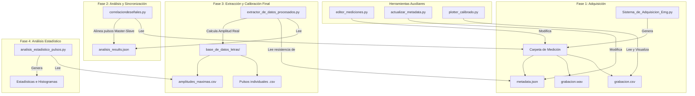

#  Sistema de Adquisición y Análisis de EMG


> **"HECHO PARA Y POR LA COMUNIDAD Y EL PUEBLO CIENTÍFICO"**

Este repositorio aloja una suite integral de software para la **adquisición, almacenamiento  y análisis** de señales de Electromiografía (EMG). El sistema gestionando el flujo desde la captura de hardware (National Instruments) hasta el reporte analítico. Este sistema está desarrollado para guardar los archivos de manera tal que sea compatible con guardar los datos por cada letra y palabra para luego hacer los experimentos de labo 7. Desarrollado por la comunidad para el **Laboratorio de Sistemas Dinamicos**

## Tabla de Contenidos
- [Características del Sistema](#-características-del-sistema)
- [Arquitectura de Datos](#-arquitectura-y-protocolo-de-datos)
- [Instalación](#-instalación-y-requisitos)
- [Guía de Uso Rápida](#-guía-de-uso-rápida)
- [Roadmap](#-roadmap-y-tareas-pendientes)

---

##  Características del Sistema

El proyecto se gestiona en la carpeta EMG  **Lanzador** (`Sistema_de_Adquisicion_Emg.py`) que integra cuatro módulos principales:

1.  **Adquisición (`CodigoUnificador_integrado.py`)**: 
    - Captura señales vía NI-DAQmx.
    - Visualización en tiempo real con filtros aplicables.
    - Metrónomo visual/auditivo integrado para protocolos experimentales.
    - Modo "Prueba" para simulación sin hardware y probar el software.
2.  **Análisis de Señal Ruido (`analisis_por_track_integrado.py`)**: 
    - Procesa grabaciones masivas.
    - Calcula SNR (Relación Señal-Ruido), latencia y amplitud.
    - Detecta y alinea picos de actividad muscular automáticamente.
3.  **Visor de Resultados (`electrode_viewer_4.py`)**: 
    - Comparativa visual de "Tracks" (promedios de pulsos).
    - Ideal para comparar diferentes electrodos o sesiones.
4.  **Inspector de Datos (`visor_csv_interactivo.py`)**: 
    - Ploteo interactivo de archivos `.csv` crudos para inspección fina.

---
### Herramientas de Gestión y Utilidades

*   **Extractor de Datos (`extractor_de_datos_procesados.py`)**:
    *   Recopila los pulsos individuales de los archivos `analisis_results.json`.
    *   Realiza una calibración de amplitud final basada en la resistencia del electrodo, calculando la "Amplitud Real".
    *   Reorganiza los datos en una nueva base de datos (`base_de_datos_letras`) clasificada por tipo de gesto.

*   **Análisis Estadístico (`analisis_estadistico_pulsos.py`)**:
    *   Lee el archivo consolidado `amplitudes_maximas.csv`.
    *   Calcula y muestra estadísticas descriptivas y genera histogramas de la "Amplitud Real" para cada categoría de gesto.

*   **Editor de Mediciones (`editor_mediciones.py`)**:
    *   GUI para renombrar y "formalizar" mediciones, asignando el formato `Letra_Prueba_Sujeto` requerido por el pipeline.

*   **Actualizador de Metadatos (`actualizar_metadata.py`)**:
    *   Script para actualizar en lote los archivos `metadata.json` de mediciones antiguas, útil para añadir nuevos campos como `resistencia_ohm`.

*   **Ploteador Calibrado (`plotter_calibrado.py`)**:
    *   Herramienta de visualización para inspeccionar los datos crudos de `grabacion.csv` aplicando una calibración de ganancia fija y filtros para generar gráficos limpios en microvolts (µV).
    * (Nueva Opcion) Ahora se puede elegir ponerle filtro basabanda, noch en 50 hz y envolvente Rms de 75 milisegundos (Se puede cambiar en el codigo). Tambien permite analizar muchas mediciones a la vez.
### En Desarrollo:
 **Análisis Avanzado de Correlación (`correlaciondeseñales.py`)**:
    *   Alinea temporalmente usando la correlación de  los pulsos de diferentes canales musculares mediante una estrategia "Master-Slave", designando un canal como líder para la sincronización.
    *   Calcula la forma de pulso promedio, y genera gráficos comparativos.
    *   Guarda resultados detallados, incluyendo los segmentos de pulso alineados, en `analisis_results.json

---
## 💾 Arquitectura y Protocolo de Datos


### Diagrama de Flujo de Datos


### Estructura de Directorios

1.  **`base_de_datos_electrodos/`**: Almacena los datos crudos y resultados de análisis por medición.
    ```
    [Letra_Prueba_Sujeto]/
    ├── grabacion.csv
    ├── grabacion.png
    ├── canal_0/
    │   ├── grabacion.wav
    │   ├── metadata.json
    │   └── analisis_results.json  # Generado por correlaciondeseñales.py
    └── ...
    ```

2.  **`base_de_datos_letras/`**: Almacena los pulsos individuales extraídos y calibrados, listos para el análisis estadístico.
    ```
    [Letra]/
    ├── canal_0/
    │   ├── [Letra_Prueba_Sujeto]_pulso_001.csv
    │   └── ...
    └── ...
    amplitudes_maximas.csv
    histograma_amplitudes_reales.png
    ```


## Instalación y Requisitos

### 1. Prerrequisitos de Hardware
- Tarjeta de adquisición compatible con **NI-DAQmx** (National Instruments).
- *Nota: Si no tienes de hardware, puedes usar el "Modo Prueba" del software para desarrollo y correción de errores*

### 2. Configuración del Entorno
Se recomienda usar un entorno virtual para aislar las dependencias.

```bash
# 1. Clonar el repositorio
git clone [https://github.com/TU_USUARIO/NOMBRE_REPO.git](https://github.com/TU_USUARIO/NOMBRE_REPO.git)
cd NOMBRE_REPO

# 2. Crear entorno virtual
python -m venv venv

# 3. Activar entorno
# Windows:
.\venv\Scripts\activate
# Linux/Mac:
source venv/bin/activate

# 4. Instalar librerías
pip install -r requirements.txt

### 3. Drivers (Crítico)
Para comunicar con la tarjeta de adquisición, **debes** instalar el driver **NI-DAQmx** desde el sitio oficial de National Instruments. Sin esto, `nidaqmx` en Python fallará.
```
---

##  Guía de Uso 

Ejecuta el lanzador en la carpeta EMG (Al abrir la carpeta en Vscode o Spider abrir Emg, si abres la carpeta del repo completo tendrias que cambiar la logica de guardado de los archivos, a futuro se espera mejorar esto.)

```bash
Sistema_de_Adquisicion_Emg.py
```
1.  **Medir:**
    * Abre "Medir".
    * Configura el dispositivo (ej. `Dev1/ai0`) y el Sample Rate (ej. 6000 S/s).
    * Activa o no el metronomo
    * Presiona "Grabar". Al detener, asigna un nombre descriptivo (ej: `Sujeto1_Biceps`).

2.  **Analizar:**
    * Abre "Análisis de Datos".
    * Selecciona la carpeta de la medición recién creada.
    * El sistema calibrará el voltaje usando el CSV y el WAV, segmentará los pulsos y guardará los resultados.
    * Si querés comparar mediciones dale clic en comparar y selecciona cuales (para ver la señal ruido por ejemplo)

3.  **Visualizar:**
    * Abre "Ver Resultados" para ver los gráficos de promedio de pulso y estadísticas de SNR.

---

## Roadmap y Tareas Pendientes

El proyecto está en desarrollo activo. Consulta `CONTRIBUTING.md` si quieres ayudar con:

- [ ] **UI:** Corregir bug visual en el checkbox del filtro Notch (no se destilda al parar adquisición).
- [ ] **Rendimiento:** Optimizar `visor_csv_interactivo.py` para archivos de larga duración.
- [ ] **Procesamiento:** Corregir la generación de espectrogramas en el análisis por track.
- [ ] **Calibración:** Implementar lógica para resistencias de 100 Ohms.
- [ ] **Señal Ruido en Tiempo Real:**  en el visor de señales estaría bueno despues de cada pulso o periado tomar el maximo y dividirlo por el ruido calculado.
- [ ] **Docs:** Documentar internamente las funciones críticas.

---

Desarrollado para la ciencia, agradecimientos al laboratorio de sistemas dinamicos y a la facultad de ciencias exactas de la uba por darnos esta oportunidad. Basado en codigos de Tomás Minini Y Roman Rolla.
