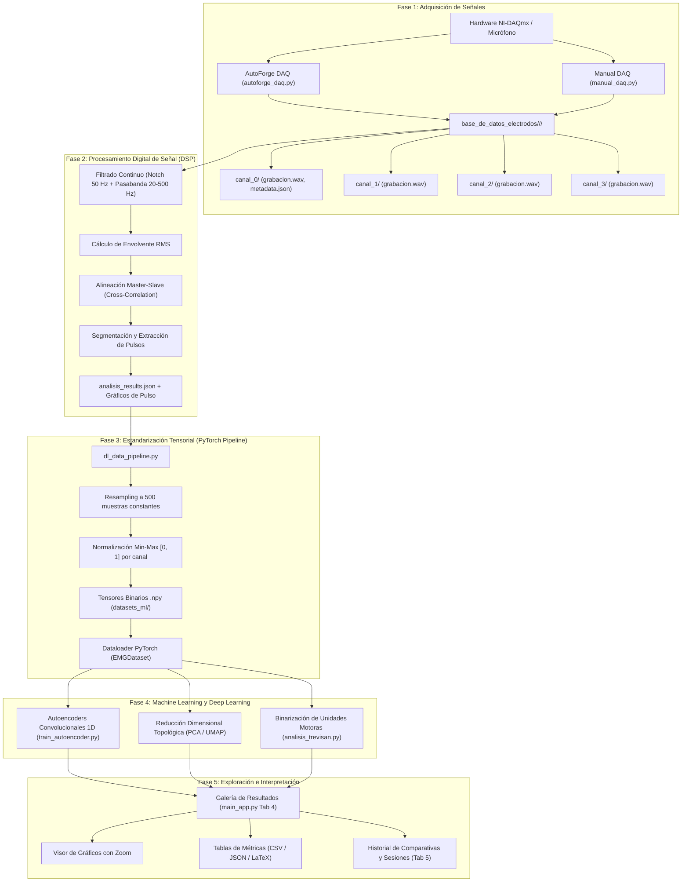

# Sistema de Adquisición y Análisis de EMG (Ñandú LSD v6.1)


[](./DESCARGAS.md)

> **"HECHO PARA Y POR LA COMUNIDAD"**

Este repositorio aloja la plataforma científica integral para la **adquisición automatizada, curación, procesamiento digital de señales (DSP), modelado por Machine Learning y Deep Learning** de señales de Electromiografía de Superficie (sEMG).

El sistema cubre la totalidad del flujo experimental: desde la captura física mediante hardware National Instruments (NI-DAQmx) o simulación acústica por micrófono, hasta la extracción de envolventes RMS, alineación temporal Master-Slave, asignación anatómica con paleta de colores fija por músculo, reducción de dimensionalidad (PCA 2D/3D, UMAP supervisado y no supervisado), binarización de patrones musculares (Método Trevisan) y compresión en espacios latentes con Autoencoders Convolucionales 1D implementados en PyTorch.

Desarrollado para el **Laboratorio de Sistemas Dinámicos (LSD)** de la **Facultad de Ciencias Exactas y Naturales (FCEyN) - Universidad de Buenos Aires (UBA)**.

---

## Tabla de Contenidos
- [Características del Sistema (v6.1)](#características-del-sistema-v61)
- [Estructura Oficial de la Base de Datos](#estructura-oficial-de-la-base-de-datos)
- [Flujo de Trabajo Científico](#flujo-de-trabajo-científico)
- [Arquitectura Modular del Código](#arquitectura-modular-del-código)
- [Pipeline de Deep Learning y Machine Learning](#pipeline-de-deep-learning-y-machine-learning)
- [Instalación y Requisitos](#instalación-y-requisitos)
- [Guía de Uso Rápida](#guía-de-uso-rápida)
- [Compilación de Ejecutables](#compilación-de-ejecutables)
- [Roadmap y Estado del Proyecto](#roadmap-y-estado-del-proyecto)
- [Créditos y Licencia](#créditos-y-licencia)

---

## Características del Sistema (v6.1)

La plataforma se gestiona desde el **Lanzador Principal** (`EMG_desarrollo/gui_app/main_app.py`), diseñado con interfaz nativa en PySide6, aceleración gráfica mediante PyQtGraph y arquitectura modular distribuida en 5 pestañas maestras y paneles especializados:

1. **Pestaña 1: Inicio y Adquisición**
   - **Sistema de Asignación y Colores Anatómicos:** Diálogo interactivo al iniciar (`MuscleSelectionDialog`) con paleta fisiológica normalizada: *Depressor Anguli Oris* (violeta), *Mylohyoid* (verde), *Orbicularis Oris* (amarillo) y *Micrófono/Canal 3* (rojo permanente).
   - **Modo Manual (Libre):** Captura continua multitrayecto con filtrado interactivo en tiempo real (Notch 50 Hz y Pasabanda 20-500 Hz), autoescala Peak-Hold y exportación estandarizada en formato WAV y CSV con metadatos de canales y músculos.
   - **Modo AutoForge DAQ:** Máquina de estados automatizada que guía al paciente mediante archivos de diccionario (`palabras.txt`). Implementa calibración dinámica de ruido basal, cuenta regresiva estandarizada, metrónomo visual/auditivo esclavo, control de pausas de relajación y cálculo adaptativo de Relación Señal-Ruido (SNR) inter-pulso para descarte preventivo de ensayos defectuosos.
   - **Modo Secuencia Continua:** Permite la grabación cíclica en bloque de diccionarios completos, generando automáticamente el vector de metadatos `valid_words` para mapeo determinístico de fonemas.

2. **Pestaña 2: Visualización**
   - **Explorador de Señales (CSV):** Visualizador de alto rendimiento basado en PyQtGraph con soporte para zoom bidireccional fluido, downsampling adaptativo, identificación de canales por nombre de músculo y filtrado matemático en caliente sobre registros continuos extensos.
   - **Historial de Gráficos Musculares:** Carga y despliegue rápido de perfiles mioeléctricos precalculados.
   - **Visor de Electrodos (Grilla):** Renderizado simultáneo y comparativo de los 4 canales físicos para inspección topográfica de la colocación de electrodos.
   - **Historial de Patrón Muscular:** Comparativa visual de activaciones musculares entre repeticiones.

3. **Pestaña 3: Análisis y Extracción**
   - **Procesamiento de Pulsos (Interactivo y Rápido):** Segmentación automática de ventanas de activación, aplicación de filtros de fase cero, cálculo de envolventes RMS y aislamiento de biopotenciales.
   - **Alineación Master-Slave:** Sincronización temporal entre canales musculares mediante correlación cruzada (*Cross-Correlation*), utilizando el canal de referencia (Canal 0) para fijar el instante de activación y preservar de forma intacta los desfases fisiológicos y la sinergia muscular inter-canal.
   - **Análisis de Sesión y Estadísticas:** Extracción de amplitudes máximas calibradas (conversión Ohms a Volts), histogramas de distribución y exportación estructurada de resultados (`analisis_results.json`).
   - **Motores Analíticos Desacoplados:** Módulos de procesamiento por lotes `discrete_motor`, `training_motor` y `generar_graficos_y_ranking` para barrido paramétrico y generación de estadísticas de calidad.

4. **Pestaña 4: Machine Learning y Deep Learning**
   - **Reducción Dimensional Lineal y No Lineal (PCA y UMAP):** Módulos integrados para Análisis de Componentes Principales (PCA 2D/3D con evaluación de métricas de silueta, distancias inter-vocales y matrices de confusión) y Uniform Manifold Approximation and Projection (UMAP supervisado y no supervisado).
   - **Autoencoders Convolucionales 1D (PyTorch):** Redes neuronales convolucionales profundas para compresión de series temporales EMG, reducción no lineal a espacios latentes 2D/3D y reconstrucción de trayectorias articulatorias.
   - **Binarización y Decodificación (Método Trevisan):** Análisis de activación discreta de unidades motoras y decodificación continua de trayectorias.
   - **Galería de Resultados Integrada:** Subpanel con visor interactivo de gráficos con zoom y visualizador de tablas de métricas estructuradas (CSV, JSON, LaTeX, TXT).

5. **Pestaña 5: Historial de Resultados**
   - **Historial de Comparativas:** Explorador centralizado de reportes multi-sesión almacenados en `analisis_comparativos/`.
   - **Historial de Sesión:** Navegación jerárquica de resultados consolidados en `analisis_de_sesiones/`.

6. **Herramientas Auxiliares y Arquitectura del Sistema**
   - **Módulo de Rutas Centralizado (`path_utils.py`):** Garantiza que todos los datos de usuario y bases de datos permanezcan junto al ejecutable y fuera del directorio interno de librerías (`_internal/`).
   - **Reproductor de Audios (Mini-DAW):** Emisión de estímulos auditivos sincronizados a través del Canal 3 del DAQ.
   - **Configuración General:** Diálogo centralizado para configurar parámetros de adquisición (frecuencia de muestreo, filtros, canales activos), asignación anatómica de músculos (*Orbicularis Oris*, *Depressor Anguli Oris*, *Mylohyoid*) y preferencias de UI con persistencia JSON.
   - **Extractor de Datos para Deep Learning (`dl_data_pipeline.py`):** Procesador por lotes que estandariza las señales a tensores `(C, 500)` normalizados en $[0, 1]$ para PyTorch.
   - **Editor y Migrador de Mediciones:** Herramientas para renombrar, curar metadatos y reestructurar carpetas de sesiones.

---

## Estructura Oficial de la Base de Datos

Para garantizar la reproducibilidad científica y evitar fallos en los pipelines de procesamiento y entrenamiento, la base de datos sigue estrictamente la jerarquía oficial establecida en las reglas del proyecto (`AGENTS.md`):

```
base_de_datos_electrodos/
└── <Fecha> (ej. 2026-06-10) /
    └── <Sesión> (ej. SecuenciaContinua_Prueba5_Sujeto1, A_T1_Lucas, etc.) /
        ├── canal_0/
        │   ├── grabacion.wav
        │   └── metadata.json
        ├── canal_1/
        │   ├── grabacion.wav
        │   └── metadata.json (Opcional)
        ├── canal_2/
        │   ├── grabacion.wav
        │   └── metadata.json (Opcional)
        └── canal_3/
            ├── grabacion.wav
            └── metadata.json (Opcional)
```

### Regla de Oro para el Procesamiento de Datos:
1. **Acceso Multi-Canal Obligatorio:** Ningún módulo DSP, script de extracción o pipeline de Machine Learning debe buscar archivos `.wav` ni `metadata.json` directamente en la raíz de la sesión (`<Sesión>/`). Debe iterar y acceder de forma explícita a través de las subcarpetas `canal_0`, `canal_1`, `canal_2` y `canal_3`.
2. **Ubicación del Archivo Maestro de Metadatos:** El archivo `metadata.json` principal —que contiene parámetros experimentales críticos como `sampling_rate`, `bpm`, `measurement_date`, `subject`, `dictionary`, `channels_mapping` y `resistencia_ohms`— reside obligatoriamente dentro del directorio `canal_0`.

---

## Flujo de Trabajo Científico

El siguiente diagrama ilustra el flujo de datos completo a través de las fases de la plataforma:


```mermaid
graph TD
    subgraph Fase1 ["Fase 1: Adquisición de Señales"]
        A["Hardware NI-DAQmx / Micrófono"] --> B["AutoForge DAQ (autoforge_daq.py)"]
        A --> C["Manual DAQ (manual_daq.py)"]
        B --> D["base_de_datos_electrodos/<Fecha>/<Sesión>/"]
        C --> D
        D --> D0["canal_0/ (grabacion.wav, metadata.json)"]
        D --> D1["canal_1/ (grabacion.wav)"]
        D --> D2["canal_2/ (grabacion.wav)"]
        D --> D3["canal_3/ (grabacion.wav)"]
    end

    subgraph Fase2 ["Fase 2: Procesamiento Digital de Señal (DSP)"]
        D --> E["Filtrado Continuo (Notch 50 Hz + Pasabanda 20-500 Hz)"]
        E --> F["Cálculo de Envolvente RMS"]
        F --> G["Alineación Master-Slave (Cross-Correlation)"]
        G --> H["Segmentación y Extracción de Pulsos"]
        H --> I["analisis_results.json + Gráficos de Pulso"]
    end

    subgraph Fase3 ["Fase 3: Estandarización Tensorial (PyTorch Pipeline)"]
        I --> J["dl_data_pipeline.py"]
        J --> K["Resampling a 500 muestras constantes"]
        K --> L["Normalización Min-Max [0, 1] por canal"]
        L --> M["Tensores Binarios .npy (datasets_ml/)"]
        M --> N["Dataloader PyTorch (EMGDataset)"]
    end

    subgraph Fase4 ["Fase 4: Machine Learning y Deep Learning"]
        N --> O["Autoencoders Convolucionales 1D (train_autoencoder.py)"]
        N --> P["Reducción Dimensional Topológica (PCA / UMAP)"]
        N --> R["Binarización de Unidades Motoras (analisis_trevisan.py)"]
    end

    subgraph Fase5 ["Fase 5: Exploración e Interpretación"]
        O --> S["Galería de Resultados (main_app.py Tab 4)"]
        P --> S
        R --> S
        S --> T["Visor de Gráficos con Zoom"]
        S --> U["Tablas de Métricas (CSV / JSON / LaTeX)"]
        S --> V["Historial de Comparativas y Sesiones (Tab 5)"]
    end
```

---

## Arquitectura Modular del Código

El repositorio está organizado en módulos desacoplados y testeables:

```
Nandu_SistemadeAdqusicionEMG/
├── README.md                           # Documentación principal del proyecto
├── CONTRIBUTING.md                     # Guía de contribución para desarrolladores
├── DESCARGAS.md                        # Enlaces a binarios precompilados
├── requirements.txt                    # Dependencias estándar de Python
├── requirements_linux.txt              # Dependencias optimizadas para Linux
├── build.bat                           # Script maestro de compilación para Windows
├── build_linux.sh                      # Script maestro de compilación para Linux
├── base_de_datos_electrodos/           # Directorio raíz de mediciones (Fecha/Sesión/Canales)
├── analisis_comparativos/              # Reportes de análisis comparativos multi-sesión
├── analisis_de_sesiones/               # Reportes consolidados de sesiones
├── datasets_ml/                        # Tensores procesados .npy e índice JSON
└── EMG_desarrollo/
    ├── gui_app/                        # Aplicación principal PySide6
    │   ├── main_app.py                 # Ventana principal, multiplexor y despachador de pestañas
    │   ├── core/                       # Hilos de adquisición, señales y workers Qt
    │   └── views/                      # Widgets de renderizado (CSV, electrodos, comparativas, análisis)
    ├── acquisition/                    # Controladores de hardware y adquisición
    │   ├── autoforge_daq.py            # Máquina de estados AutoForge por diccionario y colores
    │   ├── manual_daq.py               # Adquisición continua manual multitrayecto
    │   ├── modulo_de_entrenamiento.py  # Entrenador interactivo para captura de fonemas
    │   ├── metronomo_visual.py         # Subproceso esclavo del metrónomo
    │   └── ventana_palabras.py         # Interfaz de pauta y despliegue de palabras
    ├── analysis/                       # Algoritmos DSP, motores analíticos y alineación
    │   ├── correlaciondeseñales.py     # Alineación temporal Master-Slave por cross-correlation
    │   ├── analisis_estadistico_pulsos.py # Histograma y distribución de amplitudes reales
    │   ├── plotter_calibrado.py        # Visualizador de calibración y filtros en cascada
    │   ├── reproductor_canal3.py       # Reproductor de estímulos acústicos (Mini-DAW)
    │   ├── segmentador_secuencias.py   # Segmentador automático con propagación de metadata
    │   ├── discrete_motor.py           # Motor de segmentación y análisis discreto
    │   ├── pca_motor.py                # Motor de análisis PCA 2D/3D con métricas de clustering
    │   ├── training_motor.py           # Motor de barrido paramétrico y entrenamiento
    │   ├── umap_motor.py               # Motor de proyecciones UMAP
    │   ├── generar_graficos_y_ranking.py # Generador de rankings y gráficos consolidados
    │   └── plot_metricas_tesis.py      # Visualizador de métricas de tesis y descartes
    ├── deep_learning/                  # Arquitecturas neuronales y modelos de reducción
    │   ├── modelos.py                  # Autoencoders Convolucionales 1D en PyTorch
    │   ├── dataset_emg.py              # Clase EMGDataset y generador de lotes
    │   ├── train_autoencoder.py        # Rutina de entrenamiento de autoencoders
    │   ├── pipeline_autoencoder_gui.py # Interfaz gráfica del pipeline de autoencoders
    │   ├── decodificador_continuo.py   # Inferencia continua sobre series temporales
    │   ├── binarizacion/               # Método Trevisan de binarización de potenciales
    │   ├── pca_umap_clustering/        # Reducción dimensional (PCA, UMAP no supervisado y supervisado)
    │   └── dataset_tools/              # Visualizadores de features y trazado de 3 músculos
    ├── utils/                          # Utilidades generales, persistencia y rutas
    │   ├── path_utils.py               # Módulo central de resolución de rutas (dev y PyInstaller)
    │   ├── config_manager.py           # Gestor de configuración persistente JSON y paleta de músculos
    │   ├── logger.py                   # Sistema unificado de logging
    │   ├── editor_mediciones.py        # Interfaz de curación y renombrado de carpetas
    │   └── migrar_mediciones_por_fecha.py # Migrador de estructura de base de datos
    ├── herramientas_build/             # Herramientas de empaquetado y distribución
    │   ├── crear_entorno_ejecutable.py # Generador de entorno aislado para build
    │   ├── aplicar_parches_ejecutable.py # Inyector de compatibilidad PyInstaller
    │   ├── crear_spec_ejecutable.py    # Generador automatizado del archivo .spec
    │   └── launcher.cs                 # Lanzador nativo C# para Windows con soporte CLI
    └── instrucciones_uso.py            # Manual de usuario interactivo in-app
```

---

## Pipeline de Deep Learning y Machine Learning

### 1. Ingesta DSP y Extracción de Envolventes
- **Filtro Pasabanda:** Butterworth de 4to orden (20 Hz - 500 Hz), fase cero (`filtfilt`).
- **Filtro Notch:** IIR centrado en 50 Hz ($Q = 30$) para supresión de armónicos de red eléctrica.
- **Envolvente RMS:** Convolución cuadrática con ventana móvil de 50 ms.

### 2. Alineación Master-Slave y Tensorización
- El Canal 0 actúa como eje maestro de tiempo para detectar la cúspide articulatoria.
- Los canales restantes se recortan sobre la misma ventana temporal, preservando íntegramente la relación de fase y sinergia muscular.
- **Resampling:** Remuestreo por transformada de Fourier (`scipy.signal.resample`) a exactamente 500 puntos temporales.
- **Normalización Min-Max:** Cada canal se escala independientemente al rango $[0.0, 1.0]$.
- **Matriz de Salida:** Tensor bidimensional de dimensiones $(C, 500)$ almacenado en formato `.npy`.

### 3. Modelos Disponibles
- **Autoencoder Convolucional 1D:** Arquitectura encoder-decoder profunda con capas `Conv1d`, `BatchNorm1d`, `LeakyReLU` y `MaxPool1d` que comprime la señal a un cuello de botella latente (2D o 3D) para evaluar trayectorias fonatorias y reconstrucción de biopotenciales.
- **PCA y UMAP:** Reducción lineal y topológica no lineal para análisis de agrupamiento y separación de clases vocálicas y consonánticas, con cálculo automático de siluetas y distancias inter-clase.
- **Binarización de Trevisan:** Algoritmo biofísico de cuantización de patrones de disparo mioeléctrico.

---

## Instalación y Requisitos

### 1. Prerrequisitos de Hardware y Software
- **Python:** 3.10 o superior (compatible con Python 3.10, 3.11, 3.12).
- **Placa de Adquisición:** Compatible con NI-DAQmx (National Instruments, ej. NI USB-6212).
- **Modo Simulador:** Si no se dispone de tarjeta física NI, el software permite activar la opción **"Usar Micrófono"** para operar el pipeline analítico completo utilizando cualquier placa de sonido convencional.

### 2. Configuración del Entorno Virtual

```bash
# 1. Clonar el repositorio
git clone https://github.com/santiagopradorodriguez/Nandu_SistemadeAdqusicionEMG.git
cd Nandu_SistemadeAdqusicionEMG

# 2. Crear el entorno virtual
python -m venv venv

# 3. Activar el entorno virtual
# En Windows:
.\venv\Scripts\activate
# En Linux/macOS:
source venv/bin/activate

# 4. Instalar dependencias
# En Windows:
pip install -r requirements.txt

# En Linux:
pip install -r requirements_linux.txt
```

### 3. Driver NI-DAQmx (Requerido para Hardware Físico)
Para operar con placas National Instruments, se debe instalar el controlador oficial **NI-DAQmx**:
- [Descarga oficial de NI-DAQmx para Windows](https://download.ni.com/support/nipkg/products/ni-d/ni-daqmx/25.8/online/ni-daqmx_25.8_online.exe)

---

## Guía de Uso Rápida

Para iniciar la plataforma completa, ejecuta el lanzador maestro desde la raíz del repositorio:

```bash
python EMG_desarrollo/gui_app/main_app.py
```

### Flujo Operativo Típico:
1. **Adquisición con AutoForge:**
   - En la Pestaña 1, selecciona "AutoForge DAQ".
   - Al iniciar, confirma o edita la asignación anatómica de los músculos (*DAO*, *Mylohyoid*, *Orbicularis Oris*, *Mic*).
   - Elige el dispositivo de entrada (placa NI o micrófono) y carga el diccionario de fonemas (`palabras.txt`).
   - Define el tempo del metrónomo (ej. 30 BPM) y las repeticiones.
   - Presiona "Comenzar Grabación" y sigue las pautas visuales y sonoras. El sistema archivará los datos en `base_de_datos_electrodos/<Fecha>/<Sesión>/canal_0..3/`.
2. **Inspección de Datos:**
   - En la Pestaña 2 ("Visualización"), utiliza el Explorador CSV interactivo para revisar la calidad del registro y la respuesta de los electrodos con colores asignados por músculo.
3. **Análisis y Curación:**
   - En la Pestaña 3 ("Análisis y Extracción"), ejecuta el procesamiento interactivo de pulsos para validar envolventes RMS y sincronización Master-Slave.
4. **Machine Learning / Deep Learning:**
   - En la Pestaña 4, entrena modelos de reducción dimensional (PCA 2D/3D, UMAP supervisado y no supervisado) o ejecuta el pipeline de Autoencoders Convolucionales 1D.
   - Explora las gráficas de espacio latente y las tablas de métricas en la Galería de Resultados integrada.
5. **Historial de Resultados:**
   - En la Pestaña 5, revisa los históricos de sesiones previas y comparativas consolidadas.

---

## Compilación de Ejecutables

La plataforma puede compilarse como aplicación independiente sin requerir instalación manual de Python en la máquina de destino:

### Compilación en Windows:
Ejecuta el script por lotes desde la raíz del repositorio:
```cmd
build.bat
```
El ejecutable listo para distribución se generará en `build_windows\NanduLsd\NanduLsd.exe`.

### Compilación en Linux:
Asigna permisos de ejecución y corre el script de compilación:
```bash
chmod +x build_linux.sh
./build_linux.sh
```
El binario ejecutable y su script lanzador residirán en `build_linux/NanduLsd/run_nandu.sh`.

---

## Roadmap y Estado del Proyecto

- [x] Arquitectura modular v6.1 en PySide6 con 5 pestañas principales y galería integrada.
- [x] Cumplimiento estricto del esquema de base de datos `base_de_datos_electrodos/<Fecha>/<Sesión>/canal_0..3/`.
- [x] Sistema de colores anatómicos fijos por músculo y diálogo interactivo inicial.
- [x] Módulo centralizado `path_utils.py` con aislamiento total de carpetas de usuario fuera de `_internal/`.
- [x] Pipeline de tensores normalizados para PyTorch y soporte de Autoencoders Convolucionales 1D.
- [x] Reducción dimensional con PCA 2D/3D, UMAP supervisado/no supervisado y matrices de confusión/distancias.
- [x] Soporte multiplataforma garantizado para Windows y Linux mediante PyInstaller y lanzadores nativos.
- [x] Política estricta de Cero Emojis en toda la documentación y código fuente.
- [ ] Módulo de visualización anatómica de colocación de electrodos (`configuracion.jpg`).
- [ ] Decodificador de habla silenciosa en tiempo real conectado directamente al flujo de adquisición.
- [ ] Botón de pausa segura y reanudación de sesiones de captura durante protocolos extensos.

---

## Créditos y Licencia

Desarrollado para la investigación científica por:
- **Santiago Prado** (Investigador / Desarrollador)
- **Lucas Braunstein** (Investigador / Desarrollador)

Agradecimientos especiales al **Laboratorio de Sistemas Dinámicos (LSD)** y a la **Facultad de Ciencias Exactas y Naturales (FCEyN) de la Universidad de Buenos Aires (UBA)**. Códigos preliminares e históricos por Tomás Mininni y Román Rolla.

Proyecto publicado bajo Licencia de Código Abierto (Open Source) para fines académicos y científicos.

