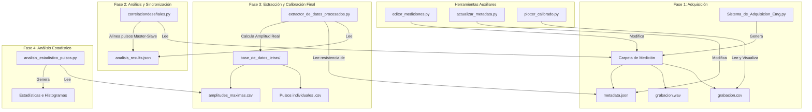

#  Sistema de Adquisición y Análisis de EMG


> **"HECHO PARA Y POR LA COMUNDIDAD"**

Este repositorio aloja el  software para la **adquisición, almacenamiento  y análisis** de señales de Electromiografía (EMG). El sistema gestionando el flujo desde la captura de hardware (National Instruments) hasta el reporte analítico. Este sistema está desarrollado tal que sea compatible con el guardado de los datos por letra y palabra listo para realizar los experimentos de laboratorio 7. Desarrollado por la comunidad para el **Laboratorio de Sistemas Dinamicos**

## Tabla de Contenidos
- [Características del Sistema](#-características-del-sistema)
- [Arquitectura de Datos](#-arquitectura-y-protocolo-de-datos)
- [Instalación](#-instalación-y-requisitos)
- [Guía de Uso Rápida](#-guía-de-uso-rápida)
- [Roadmap](#-roadmap-y-tareas-pendientes)

---

##  Características del Sistema (v3.0 - PySide6)

El proyecto se gestiona desde el **Lanzador Principal** (`gui_app/main_app.py`) que integra módulos con estética Cyberpunk y aceleración de hardware:

1.  **Adquisición (DAQ)**: 
    - Captura señales vía NI-DAQmx.
    - Visualización en tiempo real con filtros (Notch, Pasa-Banda) y auto-escala.
    - Metrónomo visual interactivo y semáforo de cuenta regresiva sincronizado.
    - "Tester de Relajación" para evaluar el ruido inter-pulso.
2.  **Análisis de Señal y Curación**: 
    - Procesa grabaciones masivas o de forma individual.
    - Visualizador de imágenes reactivo integrado en la interfaz.
3.  **Visores Nativos de Datos (CSV Viewer)**: 
    - Ploteo interactivo de archivos `.csv` crudos con downsampling extremo (LTTB).
    - Filtros dinámicos (Notch, Lowpass, Highpass) aplicables en tiempo real sin recargar el archivo.
4.  **Análisis Comparativo**: 
    - Superposición de mediciones del mismo canal para evaluar la evolución de la relación Señal-Ruido.

---
### Herramientas de Gestión y Utilidades

*   **Extractor de Datos (`extractor_de_datos_procesados.py`)**:
    *   Recopila los pulsos individuales de los archivos `analisis_results.json`.
    *   Realiza una calibración de amplitud final basada en la resistencia del electrodo, calculando la "Amplitud Real".
    *   Reorganiza los datos en una nueva base de datos (`base_de_datos_letras`) clasificada por tipo de gesto.

*   **Análisis Estadístico (`analisis_estadistico_pulsos.py`)**:
    *   Lee el archivo consolidado `amplitudes_maximas.csv`.
    *   Calcula y muestra estadísticas descriptivas y genera histogramas de la "Amplitud Real" para cada categoría de gesto.

*   **Editor de Mediciones (`editor_mediciones.py`)**:
    *   GUI para renombrar y "formalizar" mediciones, asignando el formato `Letra_Prueba_Sujeto` requerido por el pipeline.

*   **Actualizador de Metadatos (`actualizar_metadata.py`)**:
    *   Script para actualizar en lote los archivos `metadata.json` de mediciones antiguas, útil para añadir nuevos campos como `resistencia_ohm`.

*   **Ploteador Calibrado (`plotter_calibrado.py`)**:
    *   Herramienta de visualización para inspeccionar los datos crudos de `grabacion.csv` aplicando una calibración de ganancia fija y filtros para generar gráficos limpios en microvolts (µV).
    * (Nueva Opcion) Ahora se puede elegir ponerle filtro basabanda, noch en 50 hz y envolvente Rms de 75 milisegundos (Se puede cambiar en el codigo). Tambien permite analizar muchas mediciones a la vez.
### En Desarrollo:
 **Análisis Avanzado de Correlación (`correlaciondeseñales.py`)**:
    *   Alinea temporalmente usando la correlación de  los pulsos de diferentes canales musculares mediante una estrategia "Master-Slave", designando un canal como líder para la sincronización.
    *   Calcula la forma de pulso promedio, y genera gráficos comparativos.
    *   Guarda resultados detallados, incluyendo los segmentos de pulso alineados, en `analisis_results.json

---
## 💾 Arquitectura y Protocolo de Datos


### Diagrama de Flujo de Datos

```mermaid
graph TD
    subgraph Fase1 ["Fase 1: Adquisición"]
        A["Sistema_de_Adquisicion_Emg.py"] -->|Genera| B["Carpeta de Medición"]
        B --> B1["grabacion.csv"]
        B --> B2["grabacion.wav"]
        B --> B3["metadata.json"]
    end

    subgraph Fase2 ["Fase 2: Análisis y Sincronización"]
        C["correlaciondeseñales.py"] -->|Lee| B
        C -->|Alinea pulsos Master-Slave| D["analisis_results.json"]
    end

    subgraph Fase3 ["Fase 3: Extracción y Calibración Final"]
        E["extractor_de_datos_procesados.py"] -->|Lee| D
        E -->|Lee resistencia de| B3
        E -->|Calcula Amplitud Real| F["base_de_datos_letras/"]
        F --> F1["Pulsos individuales .csv"]
        F --> F2["amplitudes_maximas.csv"]
    end

    subgraph Fase4 ["Fase 4: Análisis Estadístico"]
        G["analisis_estadistico_pulsos.py"] -->|Lee| F2
        G -->|Genera| H["Estadísticas e Histogramas"]
    end

    subgraph Aux ["Herramientas Auxiliares"]
        I["editor_mediciones.py"] -->|Modifica| B
        J["actualizar_metadata.py"] -->|Modifica| B3
        K["plotter_calibrado.py"] -->|Lee y Visualiza| B1
    end
```

### Estructura de Directorios

1.  **`base_de_datos_electrodos/`**: Almacena los datos crudos y resultados de análisis por medición.
    ```
    [Letra_Prueba_Sujeto]/
    ├── grabacion.csv
    ├── grabacion.png
    ├── canal_0/
    │   ├── grabacion.wav
    │   ├── metadata.json
    │   └── analisis_results.json  # Generado por correlaciondeseñales.py
    └── ...
    ```

2.  **`base_de_datos_letras/`**: Almacena los pulsos individuales extraídos y calibrados, listos para el análisis estadístico.
    ```
    [Letra]/
    ├── canal_0/
    │   ├── [Letra_Prueba_Sujeto]_pulso_001.csv
    │   └── ...
    └── ...
    amplitudes_maximas.csv
    histograma_amplitudes_reales.png
    ```


## Instalación y Requisitos

### 1. Prerrequisitos de Hardware
- Tarjeta de adquisición compatible con **NI-DAQmx** (National Instruments).
- *Nota: Si no tienes de hardware, puedes usar el "Modo Prueba" del software para desarrollo y correción de errores*

### 2. Configuración del Entorno
Se recomienda usar un entorno virtual para aislar las dependencias. para Windows habilitar la ejecución de scripts abriendo PowerShell como administrador y correr el siguiente comando Set-ExecutionPolicy -ExecutionPolicy RemoteSigned -Scope CurrentUser

```bash
# 1. Clonar el repositorio

git clone https://github.com/santiagopradorodriguez/Nandu_SistemadeAdqusicionEMG.git
cd Nandu_SistemadeAdqusicionEMG


# 2. Crear entorno virtual
python -m venv venv

# 3. Activar entorno
# Windows:
.\venv\Scripts\activate
# Linux/Mac:
source venv/bin/activate


# 4. Entrar a la carpeta donde está el archivo de requerimientos
cd Emg

#  Instalar las librerías necesarias
pip install -r requirements.txt


### 3. Drivers (Crítico)
Para comunicar con la tarjeta de adquisición, **debes** instalar el driver **NI-DAQmx** desde el sitio oficial de National Instruments. Sin esto, `nidaqmx` en Python fallará.
Probar usando este link ( Funciona el la placa NI USB 6212 ) https://download.ni.com/support/nipkg/products/ni-d/ni-daqmx/25.8/online/ni-daqmx_25.8_online.exe
```
---

##  Guía de Uso 

Ejecuta el lanzador en la carpeta EMG (Al abrir la carpeta en Vscode o Spider abrir Emg, si abres la carpeta del repo completo tendrias que cambiar la logica de guardado de los archivos, a futuro se espera mejorar esto.)

```bash
Sistema_de_Adquisicion_Emg.py
```
1.  **Medir:**
    * Abre "Medir".
    * Configura el dispositivo (ej. `Dev1/ai0`) , si no funciona prueba cambiando el dev, y el Sample Rate (ej. 6000 S/s).
    * Activa o no el metronomo
    * Presiona "Grabar". Al detener, asigna un nombre descriptivo (ej: `Sujeto1_Biceps`).

2.  **Analizar:**
    * Abre "Análisis de Datos".
    * Selecciona la carpeta de la medición recién creada.
    * El sistema calibrará el voltaje usando el CSV y el WAV, segmentará los pulsos y guardará los resultados.
    * Si querés comparar mediciones dale clic en comparar y selecciona cuales (para ver la señal ruido por ejemplo)

3.  **Visualizar:**
    * Abre "Ver Resultados" para ver los gráficos de promedio de pulso y estadísticas de SNR.

---

## Roadmap y Tareas Pendientes (v4.0+)

El proyecto está en desarrollo activo. Consulta `ROADMAP.md` para más detalles o `CONTRIBUTING.md` si quieres ayudar con:

- [ ] **Ventana de Curación Híbrida:** Integrar nativamente Matplotlib dentro del flujo de PySide6 para la curación interactiva sin depender de popups.
- [ ] **Modo Prueba (Simulador):** Arreglar el bug de cierre/cuelgue de la aplicación al presionar "Detener Adquisición" con archivos pre-grabados.
- [ ] **ElectrodeViewer Expandido:** Agregar gráficos de "Evolución Temporal" y "Espectrogramas".
- [ ] **Visualización Anatómica:** Permitir mostrar fotos (ej. `configuracion.jpg`) automáticamente en la interfaz para documentar la disposición física de los electrodos.
- [ ] **Adquisición Dual (EMG + Audio):** Grabar audio desde un micrófono sincronizado en paralelo a la captura de la placa EMG.
- [ ] **Refactorización PySide6:** Portar completamente al nuevo ecosistema los scripts legados como `extractor_de_datos_procesados.py` y `editor_mediciones.py`.

---

"Desarrollado para la ciencia por Lucas Braunstein y Santiago Prado. Agradecimientos al Laboratorio de Sistemas Dinámicos y a la Facultad de Ciencias Exactas de la UBA por darnos esta oportunidad. Basado en códigos de Tomás Mininni y Roman Rolla."
