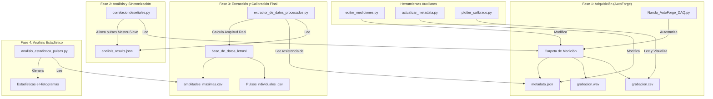

# Sistema de Adquisición y Análisis de EMG


[](./DESCARGAS.md)

> **"HECHO PARA Y POR LA COMUNIDAD"**

Este repositorio aloja el software para la **adquisición automatizada, almacenamiento y análisis** de señales de Electromiografía (EMG). El sistema gestiona todo el flujo, desde la captura de hardware (National Instruments o Micrófono) hasta la extracción y evaluación de la relación Señal-Ruido. Desarrollado con una arquitectura orientada a la creación masiva de datasets de Machine Learning, permite automatizar los protocolos de grabación de diccionarios de gestos/palabras para los experimentos de laboratorio.

Desarrollado por la comunidad para el **Laboratorio de Sistemas Dinámicos**.

## Tabla de Contenidos
- [Características del Sistema](#-características-del-sistema)
- [Arquitectura y Protocolo de Datos](#-arquitectura-y-protocolo-de-datos)
- [Instalación y Requisitos](#-instalación-y-requisitos)
- [Guía de Uso Rápida](#-guía-de-uso-rápida)
- [Roadmap y Tareas Pendientes](#-roadmap-y-tareas-pendientes)

---

## 🚀 Características del Sistema (v4.0 - PySide6 & AutoForge)

El proyecto se gestiona desde el **Lanzador Principal** (`gui_app/main_app.py`) que integra estética Cyberpunk, aceleración de hardware y múltiples módulos independientes:

1.  **Adquisición Normal (Libre)**: 
    - Captura manual de señales, visualización en tiempo real con filtros dinámicos (Notch y Pasabanda) y autoescala.
    - Metrónomo simple integrado y "Tester de Relajación" para evaluar el ruido inter-pulso.
2.  **Adquisición Automatizada (AutoForge DAQ)**: 
    - Captura señales vía hardware NI-DAQmx, o mediante el **micrófono de la PC** para pruebas y simulaciones de desarrollo sin hardware de laboratorio.
    - **Protocolo AutoForge**: Máquina de estados automatizada que guía al paciente leyendo un archivo de diccionario (`palabras.txt`). Automatiza la grabación del ruido base, cuenta regresiva, captura y descansos, reduciendo el error humano al mínimo.
    - **Metrónomo Visual y Auditivo**: Subproceso dinámico sincronizado en tiempo real para guiar los tiempos de contracción muscular mediante conteo visual gigante y pitidos sonoros.
3.  **Visualización y Calidad en Tiempo Real**: 
    - Auto-escala dinámica con sistema **"Peak-Hold"** para estabilizar la gráfica durante la captura de contracciones intensas, evitando los mareos visuales del autoscroll.
    - Medición en vivo de la Relación Señal-Ruido (**SNR**), comparando la energía de la contracción actual con el ruido de fondo (inter-pulso) evaluado automáticamente en cada ciclo.
4.  **Procesamiento de Señal (DSP)**: 
    - Filtros matemáticos en vivo (Notch 50Hz y Pasa-banda) procesados de forma continua (estado `zi`) para transiciones perfectas sin saltos.
    - Espectrograma (STFT) integrado reactivo e independiente para cada canal.
5.  **Análisis Comparativo y Extracción**:
    - Generación estandarizada de archivos de grabación para alimentar la base de datos de letras y gestos listos para el pipeline de Machine Learning.

---

## 🤖 Módulo de Autograbación Inteligente (AutoForge)
AutoForge es la nueva máquina de estados central del proyecto, diseñada para capturar datasets de forma masiva y estructurada sin intervención manual constante. Su flujo de trabajo automatizado incluye:

- **Lectura Automática de Diccionarios:** Lee un archivo `palabras.txt` para guiar al sujeto secuencialmente por todos los gestos.
- **Calibración de Ruido Base:** Antes de cada palabra, graba silenciosamente para muestrear y promediar el ruido electromagnético de fondo.
- **Sincronización:** Dispara el metrónomo visual y sonoro ("3, 2, 1, GO") para estandarizar los tiempos de preparación y contracción.
- **Validación SNR:** Registra el esfuerzo muscular y calcula automáticamente el SNR (Relación Señal-Ruido) para descartar mediciones contaminadas.
- **Auto-Guardado:** Guarda las grabaciones crudas, procesadas y metadatos con la nomenclatura perfecta para su posterior entrenamiento en Machine Learning.

---
### 🛠️ Herramientas y Módulos (Nueva Arquitectura v4.x)
El proyecto ha sido refactorizado en una arquitectura modular dentro de la rama principal de desarrollo:

#### 1. Módulo `acquisition/` (Adquisición de Hardware)
*   **`manual_daq.py`**: Interfaz de captura libre con configuración manual de ganancia y hardware.
*   **`autoforge_daq.py`**: Núcleo de autograbación por diccionario y evaluación SNR.
*   **`metronomo_visual.py`**: Subproceso esclavo para la sincronización temporal.

#### 2. Módulo `analysis/` (DSP y Procesamiento)
*   **`feature_extractor.py`**: Recopila pulsos de las mediciones y realiza calibración cruzada de amplitudes (Ohms a Volts).
*   **`analisis_estadistico_pulsos.py`**: Generación de histogramas y datos de "Amplitud Real".
*   **`plotter_calibrado.py`**: Visor de datos crudos aplicando una calibración de ganancia fija y filtros matemáticos.
*   **`correlaciondeseñales.py`**: Alineación temporal "Master-Slave" usando cross-correlation para compensar la coarticulación.

#### 3. Módulo `utils/` (Manejo de Base de Datos)
*   **`editor_mediciones.py`**: GUI para renombrar y curar mediciones post-captura.
*   **`actualizar_metadata.py`**: Script de migración en lote para archivos JSON de sesiones antiguas.

---

## 🧠 Pipeline de Deep Learning (PyTorch)
El proyecto incluye un pipeline estructurado enfocado en transformar señales crudas a tensores normalizados para el entrenamiento de arquitecturas de Deep Learning (como Autoencoders).

*   **`dl_data_pipeline.py`**: Script encargado de procesar en "Batch" las bases de datos de electrodos. 
    1. **Filtros Base**: Aplica Pasa-banda y Notch.
    2. **RMS**: Extrae la envolvente de la señal.
    3. **Alineación**: Centra los fonemas mediante la técnica "Master-Slave".
    4. **Tensorización**: Aplica _Resampling_ a 500 dimensiones constantes y normalización _Min-Max_ (0.0 a 1.0).
    5. **Dataloader**: Genera archivos `.npy` y crea la clase `EMGDataset` compatible con `torch.utils.data.Dataset`.

---
## 💾 Arquitectura y Protocolo de Datos

### Diagrama de Flujo de Datos

```mermaid
graph TD
    subgraph Fase1 ["Fase 1: Adquisición (AutoForge)"]
        A["Nandu_AutoForge_DAQ.py"] -->|Automatiza| B["Carpeta de Medición"]
        B --> B1["grabacion.csv"]
        B --> B2["grabacion.wav"]
        B --> B3["metadata.json"]
    end

    subgraph Fase2 ["Fase 2: Análisis y Sincronización"]
        C["correlaciondeseñales.py"] -->|Lee| B
        C -->|Alinea pulsos Master-Slave| D["analisis_results.json"]
    end

    subgraph Fase3 ["Fase 3: Extracción y Calibración Final"]
        E["extractor_de_datos_procesados.py"] -->|Lee| D
        E -->|Lee resistencia de| B3
        E -->|Calcula Amplitud Real| F["base_de_datos_letras/"]
        F --> F1["Pulsos individuales .csv"]
        F --> F2["amplitudes_maximas.csv"]
    end

    subgraph Fase4 ["Fase 4: Análisis Estadístico"]
        G["analisis_estadistico_pulsos.py"] -->|Lee| F2
        G -->|Genera| H["Estadísticas e Histogramas"]
    end

    subgraph Aux ["Herramientas Auxiliares"]
        I["editor_mediciones.py"] -->|Modifica| B
        J["actualizar_metadata.py"] -->|Modifica| B3
        K["plotter_calibrado.py"] -->|Lee y Visualiza| B1
    end
```

### Estructura de Directorios

1.  **`base_de_datos_electrodos/`**: Almacena los datos crudos y resultados de análisis por medición.
    ```
    [Letra_Prueba_Sujeto]/
    ├── grabacion.csv
    ├── grabacion.png
    ├── canal_0/
    │   ├── grabacion.wav
    │   ├── metadata.json
    │   └── analisis_results.json  # Generado por correlaciondeseñales.py
    └── ...
    ```

2.  **`base_de_datos_letras/`**: Almacena los pulsos individuales extraídos y calibrados, listos para el análisis estadístico.
    ```
    [Letra]/
    ├── canal_0/
    │   ├── [Letra_Prueba_Sujeto]_pulso_001.csv
    │   └── ...
    └── ...
    amplitudes_maximas.csv
    histograma_amplitudes_reales.png
    ```

---

## 💻 Instalación y Requisitos

### 1. Prerrequisitos de Hardware
- Tarjeta de adquisición compatible con **NI-DAQmx** (National Instruments).
- *Nota: Si no tienes hardware de laboratorio, puedes activar la casilla "Usar Micrófono" en la aplicación para realizar simulaciones reales utilizando cualquier placa de sonido estándar.*

### 2. Configuración del Entorno
Se recomienda usar un entorno virtual para aislar las dependencias. En Windows, si hay problemas de permisos, habilita la ejecución de scripts abriendo PowerShell como administrador y corriendo: `Set-ExecutionPolicy -ExecutionPolicy RemoteSigned -Scope CurrentUser`.

```bash
# 1. Clonar el repositorio
git clone https://github.com/santiagopradorodriguez/Nandu_SistemadeAdqusicionEMG.git
cd Nandu_SistemadeAdqusicionEMG

# 2. Crear entorno virtual
python -m venv venv

# 3. Activar entorno
# En Windows:
.\venv\Scripts\activate
# En Linux/Mac:
source venv/bin/activate

# 4. Entrar a la carpeta principal e instalar dependencias
cd Emg
pip install -r requirements.txt
```

### 3. Drivers (Crítico)
Para comunicar con la tarjeta de adquisición, **debes** instalar el driver **NI-DAQmx** desde el sitio oficial de National Instruments. Sin esto, la librería `nidaqmx` en Python fallará al intentar importar.
- Probado con la placa NI USB 6212: [Descargar NI-DAQmx (Versión Recomendada)](https://download.ni.com/support/nipkg/products/ni-d/ni-daqmx/25.8/online/ni-daqmx_25.8_online.exe)

---

## 🏃 Guía de Uso Rápida

Ejecuta el lanzador principal desde la carpeta `Emg` (si usas VSCode, asegúrate de abrir la terminal en ese directorio):

```bash
python gui_app/main_app.py
```

1.  **Modo AutoForge (Dataset Automatizado):**
    * Abre "AutoForge DAQ".
    * Configura tu dispositivo (ej. `Dev1/ai0`) o usa la opción "Usar Micrófono" si no tienes placa NI.
    * Selecciona el archivo de palabras (`palabras.txt`).
    * Ajusta el tiempo de relajación (ruido base) y las repeticiones.
    * Dale a "Comenzar Grabación" y sigue las instrucciones en la pantalla interactiva o confía en el metrónomo. El sistema guardará todo de forma estructurada automáticamente.

2.  **Modo Manual:**
    * Abre "Adquisición EMG" (Normal).
    * Habilita tus canales y presiona "Empezar a Grabar" para capturas libres.

3.  **Análisis y Procesamiento:**
    * Utiliza las herramientas complementarias descritas en la sección de Utilidades para procesar, segmentar y analizar estadísticamente las carpetas generadas.

---

## 🗺️ Roadmap y Tareas Pendientes (v4.0+)

El proyecto está en desarrollo activo. Consulta `ROADMAP.md` para más detalles o `CONTRIBUTING.md` si quieres ayudar con:

- [ ] **Visualización Anatómica:** Permitir mostrar fotos (ej. `configuracion.jpg`) automáticamente en la interfaz para documentar la disposición física de los electrodos en el sujeto.
- [ ] **Distribución y Empaquetado:** Crear un archivo ejecutable `.exe` independiente para facilitar la instalación en computadoras de laboratorio.
- [ ] **Módulos de Deep Learning:** Empezar a crear scripts base usando **PyTorch** para el entrenamiento de redes neuronales a futuro con los datos extraídos.

---

## 🐛 Errores Conocidos y Soluciones Históricas

Durante el desarrollo de la versión 4.0, nos enfrentamos a problemas de "scoping" en Python al migrar componentes de la UI. 
- **El Problema:** Al instanciar colores (`bg_panel`) en métodos `__init__`, otras funciones internas de la clase perdían la referencia en tiempo de ejecución, provocando caídas completas del programa (`NameError`).
- **La Solución:** Todo objeto visual que deba perdurar o ser accedido por funciones secundarias **debe ser instanciado usando `self.`** (ej. `self.bg_panel`). 
- **Resiliencia de la Terminal:** Como medida adicional, todos los procesos que abran sub-ventanas analíticas (como Análisis Comparativo o Análisis Integrado) ahora se ejecutan en terminales persistentes mediante `subprocess.Popen` con un `try/except` general que pausa la terminal (`input()`) al detectar un traceback, impidiendo que el error sea invisible.

---

*"Desarrollado para la ciencia por Lucas Braunstein y Santiago Prado. Agradecimientos al Laboratorio de Sistemas Dinámicos y a la Facultad de Ciencias Exactas de la UBA por darnos esta oportunidad. Basado en códigos preliminares de Tomás Mininni y Roman Rolla."*
